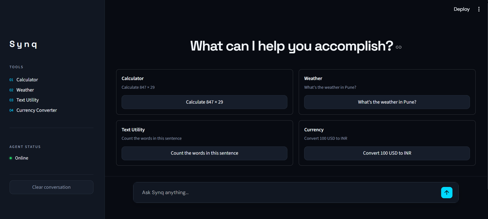

# Synq

An intelligent AI tool-calling assistant that turns natural-language requests into reliable, real-world actions.

## Demo

[](assets/synq-demo.mp4)

[Watch the Synq demo video](assets/synq-demo.mp4)

## Overview

Synq is a compact Streamlit chat application backed by the Gemini API. Ask a question in natural language and Gemini selects the most appropriate declared Python tool. Synq runs that tool, returns its structured result to Gemini, and presents Gemini's final answer in the conversation.

## Key Features

- Natural-language chat interface built with Streamlit
- Gemini function calling for tool selection
- Safe arithmetic calculator
- Current weather lookup by location
- Text operations: word count, character count, case conversion, and reversal
- Currency conversion with current Frankfurter exchange rates
- Input validation and clear handling for tool, API, timeout, and response errors
- Conversation history with a clear-conversation control

## How It Works

```text
User
  ↓
Gemini
  ↓
Tool Selection
  ↓
Tool Execution
  ↓
Tool Result
  ↓
Gemini
  ↓
Final Response
```

Gemini receives the user's message alongside declarations for the available tools. When it requests one, Synq validates and executes the corresponding Python function, sends the result back to Gemini, and returns the resulting natural-language response to the user.

## Available Tools

| Tool | Purpose | Example |
| --- | --- | --- |
| Calculator | Safely evaluates basic arithmetic expressions without using `eval()`. | `Calculate (42 * 3) / 7` |
| Weather | Resolves a location and retrieves current conditions from Open-Meteo. | `What's the weather in Pune?` |
| Text Utility | Counts words or characters, changes case, or reverses text. | `Reverse the text: Synq` |
| Currency Converter | Converts a non-negative amount between 3-letter currency codes using Frankfurter rates. | `Convert 100 USD to INR` |

## Tech Stack

- Python
- Gemini API via the Google Generative Language REST endpoint
- Streamlit
- `requests`
- `python-dotenv`
- Open-Meteo geocoding and forecast APIs
- Frankfurter currency-rate API

## Project Structure

```text
.
├── .streamlit/
│   └── config.toml       # Streamlit dark-theme configuration
├── agent.py              # Gemini orchestration and Python tools
├── app.py                # Streamlit chat interface
├── test_agent.py         # Unit tests for tools and the agent flow
├── requirements.txt      # Python dependencies
├── .gitignore            # Prevents local secrets and virtual environments from being committed
└── README.md
```

## Getting Started

1. Clone the repository and enter the project directory.

   ```powershell
   git clone https://github.com/KunalVS/Nexus-AI-tool-Agent.git
   cd Nexus-AI-tool-Agent
   ```

2. Create and activate a virtual environment.

   ```powershell
   python -m venv .venv
   .\.venv\Scripts\Activate.ps1
   ```

3. Install the dependencies.

   ```powershell
   python -m pip install -r requirements.txt
   ```

4. Create a `.env` file in the project root and add your Gemini API key.

5. Run the Streamlit application.

   ```powershell
   python -m streamlit run app.py
   ```

To run the included unit tests:

```powershell
python -m unittest -v
```

## Environment Variables

Create a local `.env` file:

```env
GEMINI_API_KEY=your_api_key_here
```

Never commit API keys. `.env` is excluded by `.gitignore`.

## Example Prompts

- `Calculate 847 × 29`
- `What is (42 * 3) / 7?`
- `What's the weather in Pune?`
- `Count the words in this sentence: small tools make demos fast`
- `Convert this text to uppercase: synq`
- `Convert 100 USD to INR`

## Error Handling

Synq validates tool inputs before execution and returns clear errors for unsupported calculator expressions, division by zero, empty text, invalid text operations, invalid currency codes, and invalid amounts. It also handles missing locations, incomplete or empty API data, unavailable weather or currency services, Gemini request timeouts, and invalid Gemini responses. Tool errors are returned to Gemini so it can explain the outcome without inventing data.

## Future Improvements

Future work could add a Wikipedia tool, GitHub repository lookup, web search, and additional productivity-focused tools. These are not part of the current implementation.

## Hackathon Context

Synq was developed for the Pleximus AI/ML Engagement & Hands-on Hackathon.
